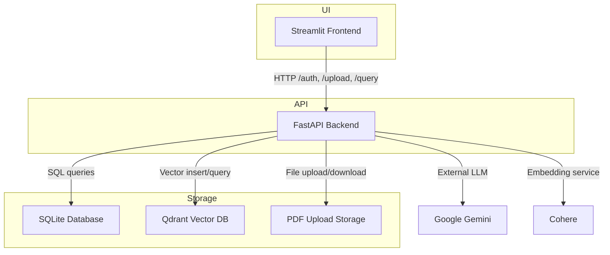
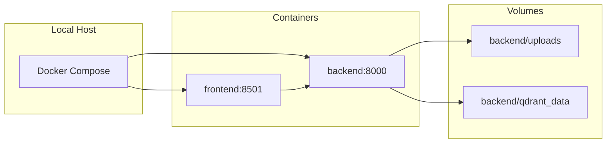
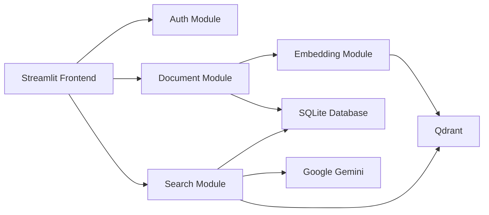
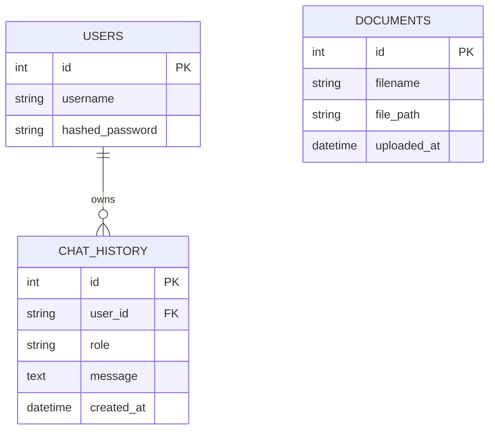
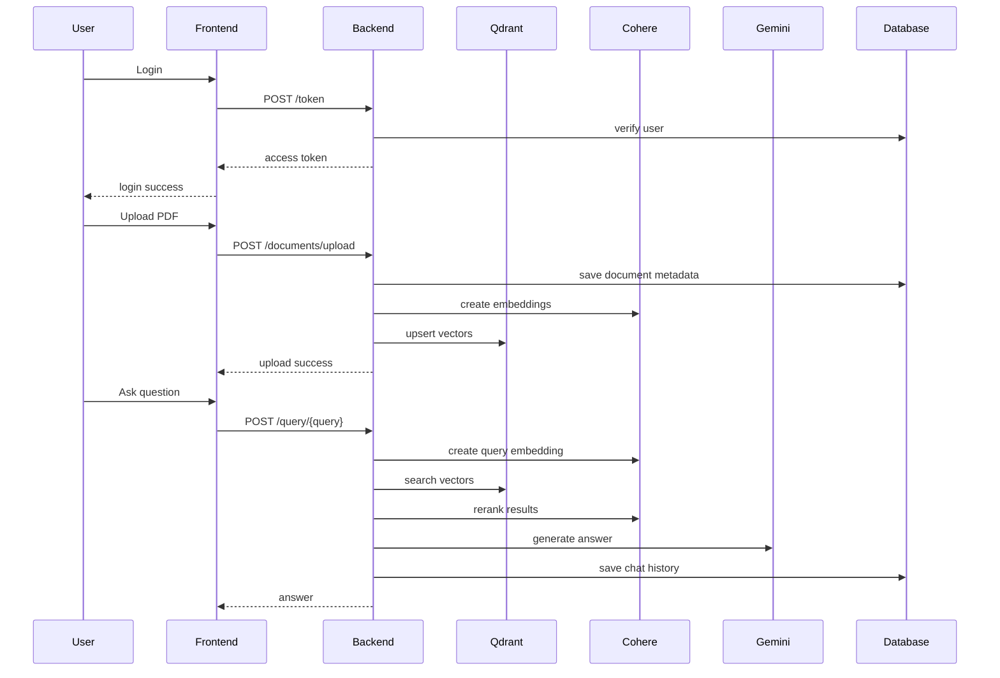

# Project 1 - Polynomial Assignment

## Overview

This project is a Retrieval-Augmented Generation (RAG) assistant built with a FastAPI backend and a Streamlit frontend. It allows users to register and log in, upload PDF documents, ingest and embed document text, store embeddings in a local Qdrant vector database, and query documents in a conversational way.

## Key Features

- User authentication with JWT tokens
- PDF upload and ingest pipeline
- Document chunking using LangChain
- Vector embeddings via Cohere
- Persistent vector storage using Qdrant
- Document search and reranking
- Conversational query answering using Google Gemini
- Document listing and deletion
- Streamlit-based frontend UI

## Architecture

- `backend/`
  - FastAPI application
  - SQLite database for users, documents, and chat history
  - Qdrant local vector store for document embeddings
  - PDF ingestion and embedding pipeline
- `frontend/`
  - Streamlit UI for authentication, document upload, browsing, and chat
- `docker-compose.yml`
  - Two-container setup: `backend` and `frontend`
  - Shared volumes for uploads and Qdrant data persistence

## Service Flow

1. User registers and logs in.
2. Upload a PDF document from the frontend.
3. Backend stores the PDF and ingests its text into chunks.
4. Each chunk is embedded and saved into Qdrant.
5. User submits a query.
6. Backend retrieves top matching chunks from Qdrant.
7. Cohere reranks the retrieved chunks.
8. Google Gemini generates the final answer using the retrieved context.
9. Chat history is saved for the current user.

## Project Structure

- `backend/main.py` - FastAPI app, auth, document upload, query, and document management endpoints
- `backend/models.py` - SQLAlchemy models for users, documents, and chat history
- `backend/schemas.py` - Pydantic schema for user registration
- `backend/database.py` - SQLite connection and session setup
- `backend/requirements.txt` - backend Python dependencies
- `frontend/streamlit.py` - Streamlit frontend UI and API client logic
- `frontend/requirements.txt` - frontend Python dependencies
- `docker-compose.yml` - container orchestration and volume mounting

## Setup and Run

### Option 1: Docker Compose

From the project root:

```bash
docker-compose up --build
```

- Backend will be available at `http://localhost:8000`
- Frontend will be available at `http://localhost:8501`

> Default test credentials for the demo frontend:
> - Username: `Hello`
> - Password: `Hello`

### Option 2: Local Python Environment

1. Create and activate a virtual environment.
2. Install backend dependencies:

```bash
cd backend
pip install -r requirements.txt
```

3. Install frontend dependencies:

```bash
cd ../frontend
pip install -r requirements.txt
```

4. Run the backend:

```bash
cd ../backend
uvicorn main:app --reload --host 0.0.0.0 --port 8000
```

5. Run the frontend:

```bash
cd ../frontend
streamlit run streamlit.py
```

## API Endpoints

- `POST /register`
  - Register a new user with `username` and `password`
- `POST /token`
  - Authenticate and receive a JWT access token
- `POST /documents/upload`
  - Upload a PDF document (requires auth)
- `POST /query/{query}`
  - Query ingested documents with a conversational search (requires auth)
- `GET /documents`
  - List all uploaded documents (requires auth)
- `GET /delete/{id}`
  - Delete a stored document and its associated embeddings (requires auth)

## Notes

- Uploaded PDFs are stored in `backend/uploads`
- Qdrant data is stored in `backend/qdrant_data`
- The SQLite database file is created in `backend/data.db`
- The frontend uses `http://rag_backend:8000` in Docker compose; when running locally outside Docker, use `http://localhost:8000`
- The current implementation contains hardcoded API keys and secret values in `backend/main.py`; these should be replaced with environment variables for production use.

## Assignment Coverage

This repository implements the following major assignment requirements:

- Secure user registration and login
- File upload support for PDFs
- Document ingestion and chunking
- Embedding and vector storage for search
- Context-aware document retrieval
- Answer generation using a language model
- Document listing and deletion
- Web UI for end-user interaction

## Mandatory Deliverables

### High-Level Architecture Diagram



### Deployment Diagram



### Component Diagram



### Database ER Diagram



### Sequence Diagrams



## API Documentation

### `POST /register`
- Description: Register a new user
- Request body:
  - `username`: string
  - `password`: string
- Response:
  - `message`: string

### `POST /token`
- Description: Authenticate a user and return a JWT token
- Request body: form data
  - `username`
  - `password`
- Response:
  - `access_token`: string
  - `token_type`: `bearer`

### `POST /documents/upload`
- Description: Upload a PDF and ingest it into the system
- Headers:
  - `Authorization: Bearer <token>`
- Request body: multipart form with PDF file under key `file`
- Response:
  - `message`: string
  - `document_id`: int

### `POST /query/{query}`
- Description: Search ingested documents and receive a conversational response
- Headers:
  - `Authorization: Bearer <token>`
- Path parameter:
  - `query`: string
- Response:
  - `result`: string

### `GET /documents`
- Description: List all uploaded documents
- Headers:
  - `Authorization: Bearer <token>`
- Response:
  - `message`: string
  - `documents`: array of document objects

### `GET /delete/{id}`
- Description: Remove a document and its vector embeddings
- Headers:
  - `Authorization: Bearer <token>`
- Path parameter:
  - `id`: int
- Response:
  - `message`: string

## Notes

- Uploaded PDFs are stored in `backend/uploads`
- Qdrant data is stored in `backend/qdrant_data`
- The SQLite database file is created in `backend/data.db`
- The frontend uses `http://rag_backend:8000` in Docker compose; when running locally outside Docker, use `http://localhost:8000`
- The current implementation contains hardcoded API keys and secret values in `backend/main.py`; these should be replaced with environment variables for production use.

## Troubleshooting

- If the frontend cannot reach the backend in Docker, verify that `backend` service is running and the API URL is correct.
- If Qdrant fails to initialize, confirm that `backend/qdrant_data` is writable and mounted correctly.
- If authentication fails, ensure login credentials are registered and the JWT token is included in requests.

---
